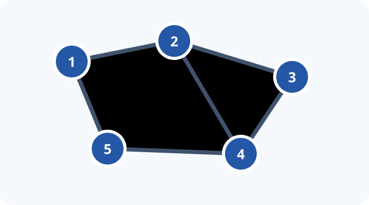

## Goal

Learn to turn a tree into an array so that familiar range-query tools can answer subtree and ancestry questions efficiently.

::: {.callout-note}
## Suggested class

**Core sequence:** [Subtree Queries](https://cses.fi/problemset/task/1137/) → [Company Queries II](https://cses.fi/problemset/task/1688/) → [Counting Paths](https://cses.fi/problemset/task/1136/)  
**Prerequisites:** DFS, arrays, and a Fenwick tree or segment tree.  
**Main pattern:** tree → intervals / ancestors → range structure or accumulation.
:::

## Problem sequence

### 1. Subtree sums and intervals

- [Subtree Queries — CSES](https://cses.fi/problemset/task/1137/): point-update a node and query its subtree sum. This is the first implementation of Euler-tour flattening plus a Fenwick tree or segment tree.
- **Subtree Sum:** use the same setup as a short warm-up. First ask students how the answer would be computed if every subtree were already an interval.

::: {.callout-tip collapse="true"}
## Solution — Subtree Queries (C++)

```cpp
#include <iostream>
#include <vector>
#include <unordered_map>
#include <unordered_set>
#include <algorithm>
#include <sstream>
#include <cmath>
#include <map>
#include <set>
#include <numeric>
#include <climits>

using namespace std;

#define DEBUG 0

#if DEBUG
#define HAS_EXTRA 1
#include "../codeforces/debug.hpp"
#endif

typedef long long int ll;
typedef vector<int> vint;

bool intersect(int l1, int r1, int l2, int r2)
{
    return max(l1, l2) <= min(r1, r2);
}

class SegTree
{
    void _update(int p, ll val, int cp, int l, int r)
    {
        if (p < l || p > r)
            return;

        if (l == r)
        {
            tree[cp] = val;
            return;
        }

        int tm = (l + r) / 2;

        _update(p, val, cp * 2, l, tm);
        _update(p, val, cp * 2 + 1, tm + 1, r);

        tree[cp] = tree[cp * 2] + tree[cp * 2 + 1];
    }

    void build(vector<ll> &a, int v, int tl, int tr)
    {
        if (tl == tr)
        {
            tree[v] = a[tl];
        }
        else
        {
            int tm = (tl + tr) / 2;

            build(a, v * 2, tl, tm);
            build(a, v * 2 + 1, tm + 1, tr);

            tree[v] = tree[v * 2] + tree[v * 2 + 1];
        }
    }

    ll _sum(int v, int tl, int tr, int l, int r)
    {
        if (l > r)
            return 0LL;

        if (l == tl && r == tr)
            return tree[v];

        int tm = (tl + tr) / 2;

        return _sum(v * 2, tl, tm, l, min(r, tm)) +
               _sum(v * 2 + 1, tm + 1, tr, max(l, tm + 1), r);
    }

public:
    vector<ll> tree;
    int size;

    SegTree(vector<ll> s)
    {
        size = s.size();
        tree.resize(4 * size);
        build(s, 1, 0, size - 1);
    }

    ll sum(int l, int r)
    {
        return _sum(1, 0, size - 1, l, r);
    }

    void update(int pos, ll v)
    {
        _update(pos, v, 1, 0, size - 1);
    }
};

void DFSFlattening(
    vector<vector<ll>> &graph,
    vector<ll> &nodes,
    int node,
    int prev,
    vector<ll> &res,
    vint &start,
    vint &end)
{
    start[node] = res.size();
    res.push_back(nodes[node]);

    for (int child : graph[node])
    {
        if (child == prev)
            continue;

        DFSFlattening(graph, nodes, child, node, res, start, end);
    }

    end[node] = res.size() - 1;
}

int main()
{
    ios::sync_with_stdio(false);
    cin.tie(nullptr);

    ll n, q;
    cin >> n >> q;

    vector<ll> nodes(n + 1);

    for (ll i = 0; i < n; i++)
        cin >> nodes[i + 1];

    vector<vector<ll>> edges(n + 1);

    for (ll i = 0; i < n - 1; i++)
    {
        ll f, t;
        cin >> f >> t;

        edges[f].push_back(t);
        edges[t].push_back(f);
    }

    vector<ll> flat;
    vint start(n + 1);
    vint end(n + 1);

    DFSFlattening(edges, nodes, 1, -1, flat, start, end);

    SegTree sg(flat);

    for (ll i = 0; i < q; i++)
    {
        ll type;
        cin >> type;

        if (type == 1)
        {
            ll s, x;
            cin >> s >> x;

            sg.update(start[s], x);
        }
        else
        {
            ll s;
            cin >> s;

            ll res = sg.sum(start[s], end[s]);
            cout << res << '\n';
        }
    }
}
```
:::

### 2. Ancestors and lowest common ancestors

- [Company Queries I — CSES](https://cses.fi/problemset/task/1687/): find the `k`th ancestor. Binary lifting without any LCA logic.

::: {.callout-tip collapse="true"}
## Solution hint — Company Queries I

Review the [CP-Algorithms guide to binary lifting for LCA](https://cp-algorithms.com/graph/lca_binary_lifting.html). For this problem, use its `up[u][j]` table only for upward jumps: `up[u][j]` is the `2^j`th ancestor of `u`.
:::

- [Company Queries II — CSES](https://cses.fi/problemset/task/1688/): answer LCA queries. This is the natural continuation after `k`th ancestor.
- [Distance Queries — CSES](https://cses.fi/problemset/task/1135/): connect LCA to the formula `dist(a, b) = depth[a] + depth[b] - 2 × depth[lca(a, b)]`.

### 3. Combining the ideas

- [Path Queries — CSES](https://cses.fi/problemset/task/1138/): update a node value and query a root-to-node path. Discuss what needs to be stored differently from a subtree sum.
- [Counting Paths — CSES](https://cses.fi/problemset/task/1136/): the capstone. For every requested path `(a, b)`, add a small number of changes and combine them with one final DFS.

For Counting Paths, if `w = lca(a, b)`, apply the tree-difference updates below, then sum child values upward in a post-order DFS:

```cpp
delta[a]++;
delta[b]++;
delta[w]--;
if (parent[w] != w) delta[parent[w]]--;

void accumulate(int u, int p) {
  for (int v : graph[u]) {
    if (v == p) continue;
    accumulate(v, u);
    delta[u] += delta[v];
  }
}
```

The important question is not “what template should I use?” but “which contributions should cancel once they meet above the LCA?”

::: {.callout-tip collapse="true"}
## The central idea: a subtree is an interval

Run a DFS and assign each node the time at which it is first visited. If we visit a whole subtree before leaving it, the nodes in the subtree of `u` occupy one contiguous interval: `[tin[u], tout[u]]`.

```cpp
int timer = 0;
const int LOG = 20;
vector<vector<int>> graph;
vector<int> tin, tout, parent, depth;
vector<array<int, LOG>> up;

void dfs(int u, int p) {
  parent[u] = p;
  up[u][0] = p;
  tin[u] = timer++;
  for (int v : graph[u]) {
    if (v == p) continue;
    depth[v] = depth[u] + 1;
    dfs(v, u);
  }
  tout[u] = timer - 1;
}
```

{fig-alt="Five connected nodes illustrating an example tree." fig-cap="DFS numbering is what turns every subtree into one array interval." width="60%"}

With this representation, a node update becomes a point update at `tin[u]`, and a subtree sum becomes a range sum from `tin[u]` to `tout[u]`.

```cpp
// Store value[u] at position tin[u].
fenwick.add(tin[u], new_value - value[u]);
value[u] = new_value;

long long subtree_sum(int u) {
  return fenwick.sum(tout[u]) - fenwick.sum(tin[u] - 1);
}
```
:::

## Ancestors in logarithmic time

Binary lifting stores the node reached after jumping upward by `2^j` edges. The table lets us find a `k`th ancestor by decomposing `k` into powers of two.

```cpp
void build_lifting(int n) {
  for (int j = 1; j < LOG; ++j)
    for (int u = 0; u < n; ++u)
      up[u][j] = up[up[u][j - 1]][j - 1];
}

int kth_ancestor(int u, int k) {
  for (int j = 0; j < LOG; ++j)
    if (k & (1 << j)) u = up[u][j];
  return u;
}
```

For LCA, first lift the deeper node until both nodes have the same depth; then lift both nodes from the largest possible jump downward until their parents agree.

```cpp
int lca(int a, int b) {
  if (depth[a] < depth[b]) swap(a, b);
  a = kth_ancestor(a, depth[a] - depth[b]);
  if (a == b) return a;

  for (int j = LOG - 1; j >= 0; --j) {
    if (up[a][j] != up[b][j]) {
      a = up[a][j];
      b = up[b][j];
    }
  }
  return up[a][0];
}
```

## Challenge: subtree and ancestor queries

Build a structure supporting subtree updates or queries together with ancestry tests. A node `u` is an ancestor of `v` exactly when:

```cpp
tin[u] <= tin[v] && tout[v] <= tout[u]
```

Ask students to decide which operations become interval operations and which require the ancestor relation directly.

## Before coding

For each problem, answer these questions first:

1. What does the DFS order make contiguous?
2. Is the query about a subtree, a root path, or a path between two nodes?
3. Which information must be combined at the LCA?
4. Is a Fenwick tree sufficient, or is a segment tree actually needed?

## Takeaway

When a tree problem looks unfamiliar, first ask whether a traversal can expose an interval, whether binary lifting exposes the relevant ancestor, or whether path contributions can cancel through an LCA.
